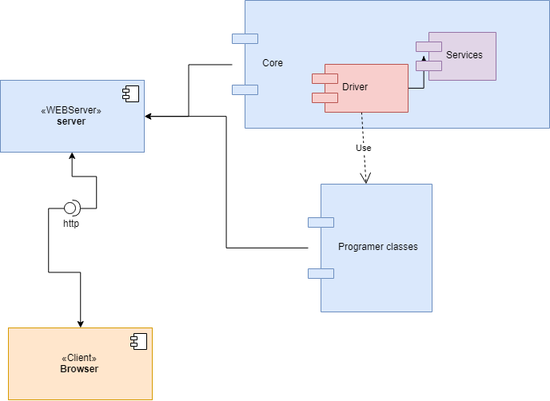
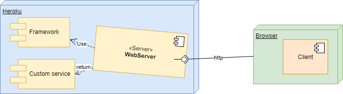

# AREP - PROJECT
## A simple web framework
This is a simple web framework that allows to the progragmer write code that will be rendered in the browser. And make their won apps int the path `/apps/{app}[?opts]`
Todo do that the programer has to use the `@Web` method annotation.
The framework also allows show pictures and html files, allocated in the server side.

### Arquitecture

## Getting Started
## Prerequisites
To use this project you must have installed the next tools.
- Java
- Maven

## Deployment
The aplication is located in Heroku. The next picture shows the deploy structure

## Built With
- Maven - Dependency Management

## Authors
Luis Eduardo Moreno Acevedo